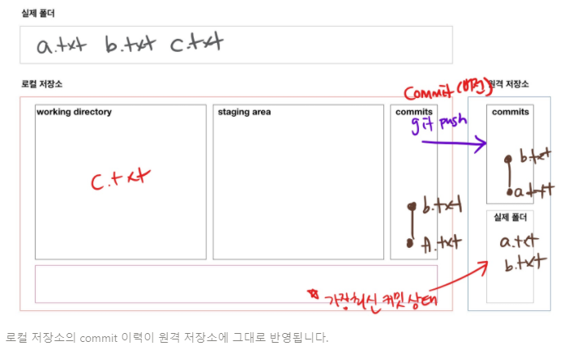
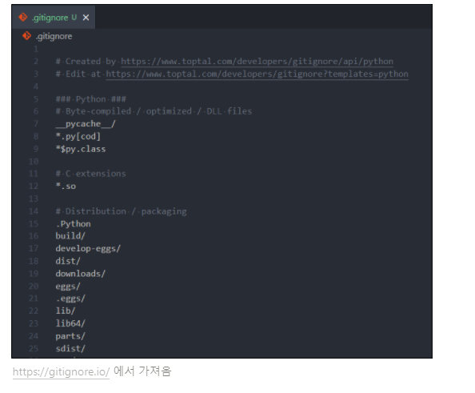
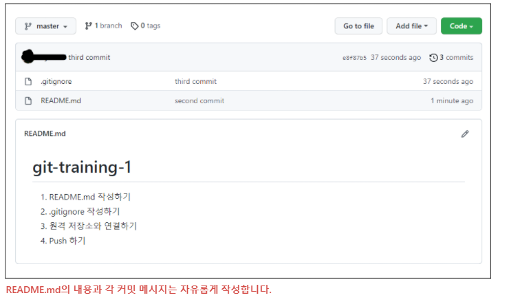
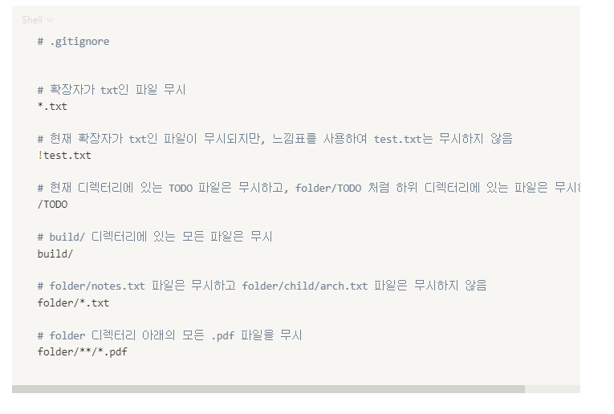
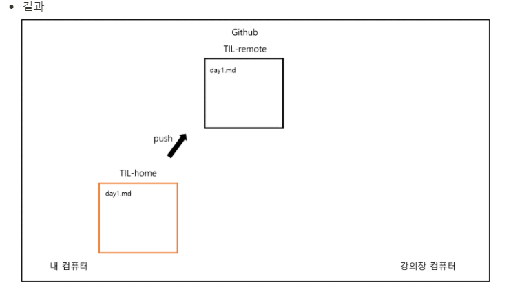

# 2일차 정리

## github

- **git init을 통해 TIL 폴더를 로컬 저장소로 만들어 줍니다.**

  - ```bash
    kyle@KYLE MINGW64 ~/TIL
    $ git init
    Initialized empty Git repository in C:/Users/kyle/TIL/.git/
    ```

- **git remote**
  - 로컬 저장소에 원격 저장소를 `등록, 조회, 삭제`할 수 잇는 명령어

1. **원격 저장소 등록**

   `git remote add <이름> <주소>` 형식으로 작성합니다.

   ```bash
   $ git remote add origin <https://github.com/edukyle/TIL.git>
   
   [풀이]
   git 명령어를 작성할건데, remote(원격 저장소)에 add(추가) 한다.
   origin이라는 이름으로 <https://github.com/edukyle/TIL.git라는> 주소의 원격 저장소를
   ```

2. **원격 저장소 조회**

​	`git remote -v` 로 작성합니다.

```bash
$ git remote -v
origin  <https://github.com/edukyle/TIL.git> (fetch)
origin  <https://github.com/edukyle/TIL.git> (push)

add를 이용해 추가했던 원격 저장소의 이름과 주소가 출력됩니다.
```

3. **원격 저장소 연결 삭제**

`git remote rm <이름>` 혹은 `git remote remove <이름>` 으로 작성합니다.

> 로컬과 원격 저장소의 연결을 끊는 것이지, 원격 저장소 자체를 삭제하는 게 아닙니다.

```bash
$ git remote rm origin
$ git remote remove origin

[풀이]
git 명령어를 작성할건데, remote(원격 저장소)와의 연결을 rm(remove, 삭제) 한다.
그 원격 저장소의 이름은 origin이다.
```

---

### 원격 저장소에 업로드

- 실습 때 작성했던 TIL 파일을 Github 원격 저장소에 업로드 해보겠습니다.
- **정확히 말하면, 파일을 업로드하는 게 아니라 커밋을 업로드 하는 것입니다!**
- 따라서 먼저 로컬 저장소에서 커밋을 생성해야 원격 저장소에 업로드 할 수 있습니다.

1. **로컬 저장소에서 커밋 생성**

   ```bash
   # 현재 상태 확인
   
   $ git status
   On branch master
   
   No commits yet
   
   Untracked files:
     (use "git add <file>..." to include in what will be committed)
           day1.md
   
   nothing added to commit but untracked files present (use "git add" to track)
   ```

   ```bash
   $ git add day1.md
   ```

   ```bash
   $ git commit -m "Upload TIL Day1"
   [master (root-commit) f3d6d42] Upload TIL Day1
    1 file changed, 0 insertions(+), 0 deletions(-)
    create mode 100644 day1.md
   ```

   ```bash
   # 커밋 확인
   
   $ git log --oneline
   f3d6d42 (HEAD -> master) Upload TIL Day1
   ```

2. **git push**

   - 로컬 저장소의 커밋을 원격 저장소에 업로드하는 명령어
   - `git push <저장소 이름> <브랜치 이름>` 형식으로 작성합니다.
   - `-u` 옵션을 사용하면, 두 번째 커밋부터는 `저장소 이름, 브랜치 이름`을 생략 가능합니다.

   ```bash
   $ git push origin master
   
   [풀이]
   git 명령어를 사용할건데, origin이라는 이름의 원격 저장소의 master 브랜치에 push 한다.
   
   ------------------------------------------------
   
   $ git push -u origin master
   이후에는 $ git push 라고만 작성해도 push가 됩니다.
   ```

---

### vscode 자격 증명 후 git push 완료

```bash
$ git push -u origin master
info: please complete authentication in your browser...
Enumerating objects: 3, done.
Counting objects: 100% (3/3), done.
Writing objects: 100% (3/3), 218 bytes | 218.00 KiB/s, done.
Total 3 (delta 0), reused 0 (delta 0), pack-reused 0
To https://github.com/edukyle/TIL.git
 * [new branch]      master -> master
Branch 'master' set up to track remote branch 'master' from 'origin'.
```

---

### git push를 그림으로 이해하기



## .gitignore

> 특정 파일 혹은 폴더에 대해 Git이 버전 관리를 하지 못하도록 지정하는 것

### (1) .gitignore에 작성하는 목록

- 민감한 개인 정보가 담긴 파일 (전화번호, 계좌번호, 각종 비밀번호, API KEY 등)
- OS(운영체제)에서 활용되는 파일
- IDE(통합 개발 환경 - pycharm) 혹은 Text editor(vscode) 등에서 활용되는 파일
  - 예) pycharm -> .idea/
- 개발 언어(python) 혹은 프레임워크(django)에서 사용되는 파일
  - 가상 환경 : `venv/`
  - `__pycache__/`

### (2) .gitignore 작성 시 주의 사항

- 반드시 이름을 `.gitignore`로 작성합니다. 앞의 점(.)은 숨김 파일이라는 뜻입니다.

- `.gitignore` 파일은 `.git` 폴더와 동일한 위치에 생성합니다.

- **제외 하고 싶은 파일은 반드시 `git add` 전에 `.gitignore`에 작성합니다.**

  

  ❗ **왜 git add 전에 .gitignore에 작성해야 할까요?**

  `git add a.txt` 라고 작성하면, 이제 Git은 `a.txt`를 버전 관리의 대상으로 여깁니다. 한 번 버전 관리의 대상이 된 `a.txt`는 이후에 .gitignore에 작성하더라도 무시되지 않고 계속 버전 관리의 대상으로 인식됩니다.

  따라서 제외 하고 싶은 파일은 반드시 git add 전에 .gitignore에 작성해야 합니다!

  

### (3) .gitignore 쉽게 작성하기

> .gitignore의 내용을 쉽게 작성할 수 있도록 도와주는 두 개의 사이트를 소개합니다. 자신의 개발 환경에 맞는 것을 찾아서 `전체 복사, 붙여넣기`를 하면 됩니다.

1. **웹사이트**

[gitignore.io](https://gitignore.io/)

2. gitignore 저장소

https://github.com/github/gitignore

3. Python에 대한 .gitignore 예시

   

### . gitignore 실습

> `Vscode, Markdown, Git 기초, Github, .gitignore` 까지 배운 것을 모두 활용하는 실습 진행

1. 홈 디렉토리에서 `git-training-1` 이라는 이름의 폴더를 만들고, 그 안에서 vscode를 엽니다.
2. Github에서 마찬가지로 `git-training-1` 이름으로 원격 저장소를 생성합니다.
3. 로컬 저장소에서 `README.md`와 `.gitignore` 파일을 만든 후 첫 번째 커밋을 기록합니다.
4. Typora를 이용해 `README.md`를 자유롭게 작성하고 두 번째 커밋을 기록합니다.
5. `no.txt` 파일을 만든 후 `.gitignore`에 등록하고 세 번째 커밋을 기록합니다.
6. 로컬 저장소와 원격 저장소를 연결합니다.
7. 로컬 저장소의 변경 사항을 원격 저장소에 업로드 합니다.



### 심화

> .gitignore에 대해 조금 더 알아봅니다.

#### (1) .gitignore 패턴 규칙

1. 아무것도 없는 라인이나, `#`로 시작하는 라인은 무시합니다.
2. `슬래시(/)`로 시작하면 하위 디렉터리에 재귀적으로 적용되지 않습니다.
3. 디렉터리는 `슬래시(/)`를 끝에 사용하는 것으로 표현합니다.
4. `느낌표(!)`로 시작하는 패턴의 파일은 ignore(무시)하지 않습니다.
5. 표준 Glob 패턴을 사용합니다.
   - `*(asterisk)`는 문자가 하나도 없거나 하나 이상을 의미합니다.
   - `[abc]`는 중괄호 안에 있는 문자 중 하나를 의미합니다.
   - `물음표(?)`는 문자 하나를 의미합니다.
   - `[0-9]`처럼 중괄호 안에 하이픈(-)이 있는 경우 0에서 9사이의 문자 중 하나를 의미합니다.
   - `**(2개의 asterisk)`는 디렉터리 내부의 디렉터리까지 지정할 수 있습니다. (`a/**/z`라고 작성하면 `a/z`, `a/b/z`, `a/b/c/z` 까지 모두 영향을 끼칩니다.)

#### (2) 패턴 예시



---

## clone, pull

### [1] 원격 저장소 가져오기

> 지금까지는 로컬 저장소의 내용을 원격 저장소에 업로드하는 것을 학습했습니다. 이번에는 반대로, 원격 저장소의 내용을 로컬 저장소로 가져오는 것을 학습합니다.

#### (1) git clone

- 원격 저장소의 커밋 내역을 모두 가져와서, 로컬 저장소를 생성하는 명령어

- clone은 `"복제"`라는 뜻으로, `git clone` 명령어를 사용하면 원격 저장소를 통째로 복제해서 내 컴퓨터에 옮길 수 있습니다.

- `git clone <원격 저장소 주소>`의 형태로 작성합니다.

  ```bash
  $ git clone <https://github.com/edukyle/TIL.git>
  Cloning into 'TIL'...
  remote: Enumerating objects: 3, done.
  remote: Counting objects: 100% (3/3), done.
  remote: Total 3 (delta 0), reused 3 (delta 0), pack-reused 0
  Receiving objects: 100% (3/3), done.
  ```

  위에 작성한 대로 실행하면, `Github의 edukyle이라는 계정의 TIL 원격 저장소를 복제`하여 내 컴퓨터에 TIL이라는 이름의 로컬 저장소를 생성하게 됩니다.

- git clone을 통해 생성된 로컬 저장소는 `git init`과 `git remote add`가 이미 수행되어 있습니다.

#### (2) git pull

- 원격 저장소의 변경 사항을 가져와서, 로컬 저장소를 업데이트하는 명령어

- 로컬 저장소와 원격 저장소의 내용이 완전 일치하면 git pull을 해도 변화가 일어나지 않습니다.

- `git pull <저장소 이름> <브랜치 이름>`의 형태로 작성합니다.

  ```bash
  $ git pull origin master
  From <https://github.com/edukyle/git-practice>
   * branch            master     -> FETCH_HEAD
  Updating 6570ecb..56809a9
  Fast-forward
   README.md | 1 +
   1 file changed, 1 insertion(+)
  
  [풀이]
  git 명령어를 사용할건데, origin이라는 원격 저장소의 master 브랜치의 내용을 가져온다(pull).
  ```

 💡 **git clone vs git pull**

clone과 pull이 모두 원격 저장소로부터 가져오는 명령어라서 조금 혼동될 수 있습니다.

`git clone`은 git init처럼 처음에 한 번만 실행합니다. 즉 로컬 저장소를 만드는 역할이죠. 단, git init처럼 직접 로컬 저장소를 만드는 게 아니라, Github에서 저장소를 복제해서 내 컴퓨터에 똑같은 복제본을 만든다는 차이가 있습니다.

`git pull`은 git push처럼 로컬 저장소와 원격 저장소의 내용을 동기화하고 싶다면 언제든 사용합니다. 단, push는 로컬 저장소의 변경 내용을 원격 저장소에 반영하는 것이고, pull은 원격 저장소의 변경 내용을 로컬 저장소에 반영하는 것입니다. **즉 방향이 다릅니다!**

### [2] 내 컴퓨터 ↔ Github(원격 저장소) ↔ 강의장 컴퓨터

> 두 개 이상의 로컬 저장소에서 하나의 원격 저장소에 접근하면 어떻게 될까요? 집과 강의장을 오가면서 `clone, push, pull` 하는 과정을 살펴보겠습니다.

#### (1) 규칙

- 수업 때는 두 개의 폴더를 `"내 컴퓨터"`와 `"강의장 컴퓨터"` 라고 가정합니다.
- 내 컴퓨터에 있는 로컬 저장소의 이름은 `TIL-home` 입니다.
- 강의장 컴퓨터에 있는 로컬 저장소의 이름은 `TIL-class` 입니다.
- Github에 있는 원격 저장소의 이름은 `TIL-remote` 입니다.

#### (2) 사전 세팅

- 홈 디렉토리 안에 `TIL-home` 폴더를 생성합니다.

- Github에서 `TIL-remote` 라는 이름의 원격 저장소를 생성합니다.

- `TIL-home` 폴더에서 vscode를 엽니다.

- 아래와 같은 절차를 진행합니다.

  ```bash
  # TIL-home
  
  $ git init
  $ touch day1.md
  $ git add .
  $ git commit -m "집에서 Day1 작성"
  $ git remote add origin <https://github.com/edukyle/TIL-remote.git>
  $ git push origin master
  ```

  `TIL-home` 로컬 저장소의 내용이 `TIL-remote` 원격 저장소에 그대로 반영되었습니다.



​					**이제 내 컴퓨터, Github, 강의장 컴퓨터의 내용은 동일합니다.**

 ❗ **만약 TIL-home에서 pull이 아니라 commit을 먼저한 후 pull을 하면 어떻게 될까요? 다음 세 가지의 경우가 있을 수 있습니다.**

1. 내 컴퓨터와 강의장 컴퓨터에서 **서로 다른 파일을 수정**한 경우 → 정상적으로 git pull이 됩니다.
2. 내 컴퓨터와 강의장 컴퓨터에서 **같은 파일을 수정했지만, 수정한 라인이 다른** 경우 → 정상적으로 git pull이 됩니다.
3. 내 컴퓨터와 강의장 컴퓨터에서 **같은 파일의 같은 라인**을 수정한 경우 → **충돌(conflict)**이 발생합니다. 어느 내용을 반영할지 직접 선택해야 합니다.


 ❗ **만약 TIL-home에서 pull이 아니라 commit을 먼저한 후 바로 push 하면 어떻게 될까요?** **아래와 같은 에러 메시지가 나타나면서 push가 실패합니다.**

```bash
To https://github.com/edukyle/TIL-remote.git
! [rejected]     master -> master (non-fast-forward)
error: failed to push some refs to 'https://github.com/edukyle/TIL-remote.git'
```

원격 저장소의 내용을 먼저 받아오지 않고, 로컬 저장소에서 새로운 커밋을 생성했기 때문에 서로의 커밋 내역이 달라져서 그렇습니다.

만약 로컬 저장소와 원격 저장소의 내용이 다르다면 일단 git pull을 통해 동기화를 시키고 새로운 커밋을 쌓아 나가야 합니다.


